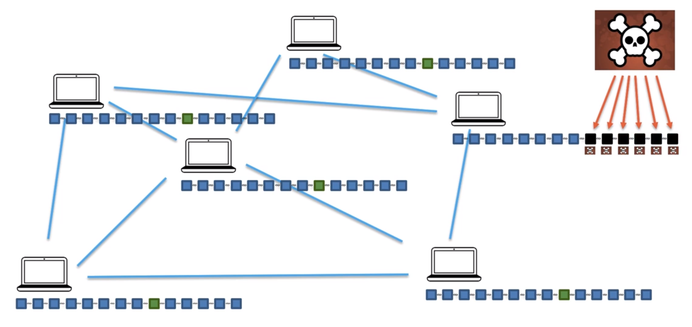

### Tutorials and Notes to 'Blockchain A-Z - Learn how to build your first blockchain' (Udemy)
---

*These are just my personal comments for later refreshing. I can highly recommend taking the course if you are interested in the topic and just starting out (https://www.udemy.com/build-your-blockchain-az/).*

### Blockchain Intuition

#### What is a Blockchain?
*A blockchain is a continuously growing list of records, called blocks, which are linked and secured using cryptography. \
(Wikipedia)*

* Origin: Paper 'How to Time-Stamp a Digital Document (1991)'
* Block
    * Data: "Hello World!"
    * Prev. Hash: 034DFA357
    * Hash:       4D56E1F05
* Genesis Block (First block)
* Blocks are linked like linked lists (Prev. Hash is pointer to previous block)

*© SuperDataScience*

#### Understanding SHA256-Hash

* Comes from the NSA
* One of the core principle of the blockchain
* 64 characters
* 64 chars * 4 bits = 256 bits
* https://tools.superdatascience.com/blockchain/hash
* The 5 requirements for hash algorithms:
    * One-Way
    * Deterministic
    * Fast computation
    * The Avalanche Effect
        * Input changes slightly -> output changes significantly
    * Must withstand collision
        * Pigeonhole principle

#### Immutable Ledger

* Traditional ledgers where written
* Immutable ledger -> blockchain
* If you could hack one block, every following block is invalid and would have to be hacked as well because of the cryptographic link -> not possible

Interesting reading: https://medium.com/cryptoeconomics-australia/the-blockchain-economy-a-beginners-guide-to-institutional-cryptoeconomics-64bf2f2beec4

#### Distributed P2P Network

*© SuperDataScience*

* The consensus determines whoose chain is valid
* If your local chain is considered invalid by the consensus it gets replaced

How to hack into a blockchain:
* Exchange data block
* Recompute current hash
* Recompute all following hash
* Deploy this change on the majority of peers at the same time

#### How Mining Works: The Nonce

* Its (mining) all about the nonce
* One block can contain multiple transactions

*© SuperDataScience*

#### How Mining Works: The Cryptographic Puzzle

SHA256-Hash: 6ac3c336e4094835293a3fed8a4b5fedde1b5e2626d9838fed50693bba00af0e\
As decimal number: 48291044447847787216835688875138221669503123235521482818857727304311439929102

* Finding the hash (the Golden Nonce) is called the cryptographic puzzle
* How it works:
    * Keep iterating the nonce until you get below the target
    * Add the block
    * Whole things starts over

*© SuperDataScience*

#### Byzantine Fault Tolerance

*© SuperDataScience*

* No more than 1/3 of the participants must be traitors
* The byzantine general problem: https://people.eecs.berkeley.edu/~luca/cs174/byzantine.pdf

#### Consensus Protocol

* Cryptographic puzzle: hard to solve - easy to verify
* *The longest chain is king*
* In a blockchain you only need > 50% for consensus

*© SuperDataScience*

*A short guide for the consensus protocols:* 
*https://www.coindesk.com/short-guide-blockchain-consensus-protocols*  
*Try it out:*
*https://tools.superdatascience.com/blockchain/coinbase*

### Cryptocurrency Intuition

#### What ist Bitcoin?

* Bitcoin is not only a coin but a protocol
* Developed by a person/team going by the name Satoshi Nakamoto in 2008
* There are basically 3 layers in cryptocurrency
* ICO's are about tokens and not coins (misleading term)

*© SuperDataScience*

#### Bitcoin's Monetary Policy

* There are mainly two parts:
    * The Halving: the amount of bitcoins per block is halving every 210k blocks (ca 4 years)
       
    *@ SuperDataScience*
    * Block Frequency: the average block time is different for every currency. For Bitcoin the average block time is 10 minutes.  
       
    *@ SuperDataScience*  
* Because of rouding issues (decimal numbers) the number of BTCs per block will reach a dead end in 2140 (21 billion bitcoins)
* Transaction fees are meant to replace block rewards

*Overview of Coins and Tokens:*  
*https://coinmarketcap.com/*

*Lots of information about blockchain:*  
*https://blockchain.info/*

*Interesting read:*  
*https://guerrilla-capitalism.com/articles/this-time-is-different-part-2-what-bitcoin-really-is/*

#### Understanding Mining Difficulty

* The Mining Difficulty is measured in: current target / max target (initial target)
* The difficulty is adjusted every 2016 blocks (2 weeks) to keep the average block time at 10 minute
* Last block as of this writing is (#580675): 000000000000000000054fb67245b74d6e26713a6051b4a3bdc203b18439bf79
    * 19 leading zeroes -> 16^(64-19) possibilities
* First block had 8 leading zeroes -> 16^(64-8) possibilities
* Current probability:  
      
* Current difficulty (how much harder is the mining now than in the beginning):
    * 7,409,399,249,090.25
* Classic banking uses interest rates for the same process

#### Mining Pools

  
*@ SuperDataScience*

* To compete with large scale mining facilities miners can join mining pools
* Within these mining pools the claculation of the nonce gets distributed (they are trying another range of numbers)
* If a mining pool finds a golden nonce. The reward is distributed according to the mining power of the nodes
* China is currently hosting the most mining pools
* If the miners are viewed as a country they would rank 61st in world electricity consumption

  

*Mining pools:*  
*https://www.buybitcoinworldwide.com/mining/pools/*

*Interesing article on different views of bitcoins electricity consumption:*  
*https://blog.bitcoin.org.hk/bitcoin-mining-and-energy-consumption-4526d4b56186*

#### Nonce Range

* The nonce is an (unsigned) integer of 32bits and therefore has only 4 billion possible values
* A modest miner calculates 100 million hashes per second (MH/s)
* The probability of getting the nonce however is 2x10^-22
* So the probability of ONE nonce in the range beeing the golden nonce is still only 10^-12
* Conclusion: **One nonce range is not enough**
* Solution: **The timestamp** in the block
* Trough the timestamp the nonces are getting resetted every seconds and can be reused
* This solves the problem for indiviudal miners
* For mining pools however with capacities of 22 million trillion hashes/sec the problem still persists (the nonce range would be finished long before a second)

  
*@ SuperDataScience*

#### How Miners Pick Transactions

* The transactions are getting stored in the mempool
* 2'000 tranactions fit in one block
* If your transaction is too small, it can get stuck in the mempool and returned to you
* The miners pick the highest transactions in the mempool
* If the nonce range has reached its end end the timestamp is still the same, the smallest transaction gets replaced with the next smallest
* With the new transaction the data of the block has changed and the nonce's can be reused

  
*@ SuperDataScience*

